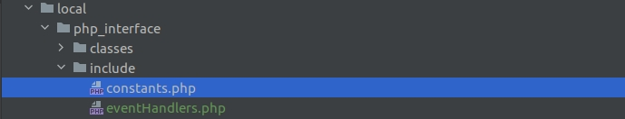

Структура проекта
===============

Типовая структура файлов и папок для упрощения работы с проектом

## Введение

При работе нескольких разработчиков на проекте возникают трудности в организации структуры библиотеки классов,
обработчиков и других вспомогательных скриптов. Нет единообразия. Каждый разработчик создает скрипты так как ему удобно
и где удобно. Код получается разрозненным, неструктурированным. Поддержка проекта усложняется.

## Цель

Внедрение единообразной структуры проекта для поддержания целостности, структурированности. Обеспечение удобства
поддержки проекта.

## Особенности

Данная структура работает только при наличии установленного на проекте модуля "Инструменты разработчика"

Убедитесь в наличии модуля на проекте. Если его нет, то установить можно по ссылке
https://github.com/worksolutions/bitrix-module-tools

## Внедрение
На старте разработки проекта или при приеме готового проекта на поддержку необходимо придерживаться следующей схемы
размещения скриптов:
1. В папке /local (если такой нет, то создать) создать папку /php_interface/

2. В /php_interface добавить следующие папки и файлы:
   
- Папка /classes/ - для хранения библиотеки классов. Классы рекомендуем группировать по предназначению. Например,
агенты размещать в папке Agents, обработчики в папке Handlers, хелперы в папке Helpers, сервисы в папке Services

- Папка /include/ - для хранения подключаемых скриптов, например константы или регистрация обработчиков

- Файл .ws_tools_config.php - настройка namespace для автоматического подключения классов из папки /classes/

- Файл config.php - файл конфигурации сервисов

- Файл init.php, в котором происходит подключение вышеперечисленных файлов

3. В папке /static (если такой нет, то создать) необходимо размещать файлы стилей, скриптов JS, шрифтов, статических
изображений. Пример размещения:

